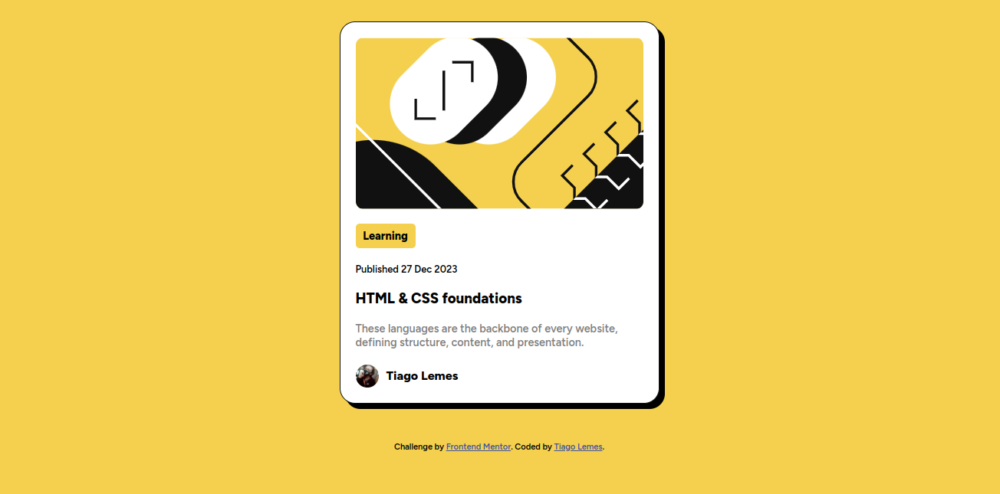

# 🌟 Blog Preview Challenge

  

## What's This About?

This right here is pure code turning into art! This is my take on the Frontend Mentor Blog Preview challenge. I snagged an awesome design from Frontend Mentor and turned it into a web page using HTML and CSS.

## Incredible Tech Used

- HTML5
- CSS3

## Check This Out!

Look at this beauty! 📸 

## How to Unleash This Magic?

1. Clone this repository.
2. Open the `index.html` file in your browser to witness this sorcery yourself.

## Amazing Learnings

- Sharpened my skills in HTML and CSS.
- Explored the realm of responsive design and modern web dev practices.

## Want More Deets?

- [Take a peek at the Frontend Mentor challenge](https://cupcakesoft.com/projetos/css_front_end_mentor_challenge_blog_preview_card)
- [Peep my profile on Frontend Mentor](https://www.frontendmentor.io/profile/tiagoskaterock)

## Lend Some Magic!

Contributions are always welcome! If you have ideas to enhance this wizardry, open an issue or send a pull request.

## Crafted by a Code Wizard

Tiago Lemes
